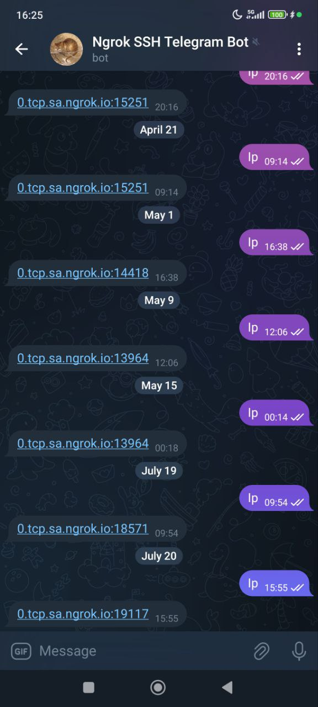

# ngrok SSH Telegram Bot

A Python tool that automatically creates secure SSH tunnels using ngrok and sends connection details via Telegram bot notifications.



## Overview

Ever needed SSH access to your development machine while away, only to find it's behind NAT or a restrictive firewall? This tool solves that problem by combining ngrok tunneling with Telegram bot notifications for secure, temporary remote access.

## Features

- **Async Architecture**: Built with Python's `trio` library for concurrent operations
- **Secure Authorization**: Only pre-authorized Telegram users receive connection details  
- **Automatic Tunnel Management**: Handles ngrok tunnel creation and monitoring
- **Real-time Notifications**: Sends SSH connection info directly to your Telegram chat
- **Robust Error Handling**: Automatic retry logic for reliable connections

## Architecture

```
┌─────────────────┐    ┌─────────────┐    ┌─────────────────┐
│  Local Machine  │───▶│    ngrok    │───▶│  Public Access  │
│   (SSH on :22)  │    │   Tunnel    │    │   tcp://...     │
└─────────────────┘    └─────────────┘    └─────────────────┘
         │                                          │
         ▼                                          │
┌─────────────────┐                                 │
│ Telegram Bot    │◀────────────────────────────────┘
│ (Authorized     │
│  Users Only)    │
└─────────────────┘
```

## Quick Start

### Prerequisites

1. Install ngrok: `sudo snap install ngrok`
2. Get an [ngrok auth token](https://dashboard.ngrok.com/get-started/your-authtoken)
3. Create a Telegram bot via [@BotFather](https://t.me/botfather)
4. Get your Telegram user ID from [@userinfobot](https://t.me/userinfobot)

### Installation

1. Clone this repository
2. Install dependencies: `uv sync`
3. Configure the required JSON files (see Configuration section)

### Configuration

Create these three JSON files in the project root:

#### `ngrok_authtoken.json`
```json
{
  "ngrok_authtoken": "your_ngrok_authtoken_here"
}
```

#### `bot_token.json`
```json
{
  "bot_token": "your_telegram_bot_token_here"
}
```

#### `users.json`
```json
{
  "allowed": {
    "user1": 123456789,
    "user2": 987654321,
    "colleague": 456789123
  }
}
```

**Note**: User IDs are numeric values, not usernames. The keys are just labels for your reference.

### Usage

1. Start the launcher:
   ```bash
   python launcher.py
   ```

2. The tool will:
   - Launch ngrok tunnel to localhost:22
   - Poll ngrok API for connection details
   - Send SSH connection info to authorized Telegram users

3. Message your bot with `ip` to get connection details.

## Dependencies

```toml
dependencies = [
    "python-telegram-bot==21.6",
    "trio>=0.29.0", 
    "typer>=0.15.2",
    "httpx"
]
```

## Security Considerations

### ✅ What's Secure
- **User Authorization**: Only pre-defined Telegram users get access info
- **Temporary Tunnels**: ngrok tunnels are ephemeral
- **No Permanent Exposure**: SSH isn't permanently exposed to internet
- **Encrypted Transport**: ngrok provides TLS encryption

### ⚠️ Security Notes
- Use strong SSH key authentication
- Consider IP whitelisting for additional security

## Use Cases

- **Remote Development**: Access your dev machine from anywhere
- **Temporary Collaboration**: Give colleagues temporary SSH access
- **Debugging**: Quick access to staging environments
- **IoT Device Management**: Access devices behind NAT
- **Conference Demos**: Share access during presentations

## How It Works

The tool uses async Python with `trio` to run two concurrent tasks:

1. **Launch ngrok process and monitor tunnel**: Creates secure tunnel to localhost:22
2. **Launch Telegram Bot**: Launch Telegram bot to serve connection details through it.

Once the tunnel is established, the Telegram bot automatically sends connection information to authorized users.

## Extending the Tool

The modular design makes it easy to extend for:
- Multiple services (HTTP, databases, etc.)
- Different notification channels (Discord, Slack, email)
- Access logging and monitoring
- Auto-expiration features

## License

This project is licensed under the MIT License.
See the [LICENSE](./LICENSE) file for more details.

## Contributing

Contributions are welcome! If you have suggestions for improvements or want to fix a bug, feel free to open an issue or submit a pull request.

**To contribute:**

1. Fork this repository.
2. Create a new branch (`git checkout -b feature/my-feature`).
3. Commit your changes (`git commit -am 'Add some feature'`).
4. Push to the branch (`git push origin feature/my-feature`).
5. Open a pull request.

Please make sure your code follows the existing style and includes tests if relevant.
By contributing, you agree that your contributions will be licensed under the MIT License.
